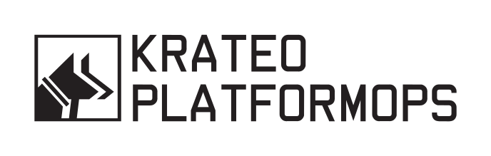

**Krateo Platformops** is an open-source tool platform that allows users to create any desired resource on any infrastructure they'd like. Whether you need a K8s cluster, microservice, application, pipeline, database, or anything else, Krateo has your back. The only requirement is for the resource to be descriptive via a YAML file representing the resource's _desired state_ (rings a bell? 😉).

Krateo allows for:

- **Creating any resources within and outside the Kubernetes cluster it runs on**: whilst Krateo runs as a Deployment in a Kubernetes cluster, it can also create resources _outside_ the cluster. You can use Krateo to create anything from new Kubernetes clusters, Logstash pipelines, Docker registries, API gateways, etc.
- **Focusing on the management of services**: Krateo frees the user from most of the burden of cluster management, allowing them to focus on the services that must be run entirely. This results in a phenomenal user experience that drastically reduces wasted time.
- **Single-handedly monitoring and controlling resources**: Krateo also acts as a centralized control plane, letting users monitor anything ranging from CI/CD pipelines to pod statuses and open tickets on your JIRA. All the information you need is on a single page -- you'll never have to guess the correct dashboard again.

## Our mission

With Krateo, we aim to combine many excellent tools from the CNCF landscape to provide our users with a simple-to-use, complete, and modular platform that allows for creating resources on any infrastructure. We see Krateo as a powerful tool that improves the workflow of teams by defining clear roles in which the infrastructure team creates the resource templates needed by the developers, and the developers are the final users that use those templates and can manage the lifecycle of the created resources from a simple, unified dashboard.

In our vision, Krateo is:

- a _self-service platform_, where users can autonomously choose what to create and where;
- a complete _controlplane_ that eases and centralizes many processes, putting all the relevant information in a single page rather than distributing it in tens of different locations;
- a _multi-cloud provider_ tool: it works with all the major cloud providers and with on-prem installations;
- either managed or easily installable on your existing Kubernetes cluster.

## Getting started

You will find whatever you need in the official <a href="https://docs.krateo.io/">documentation</a>.

If you want a playground for testing Krateo, look at our free self-service <a href="https://killercoda.com/krateoplatformops/">lab</a>.
